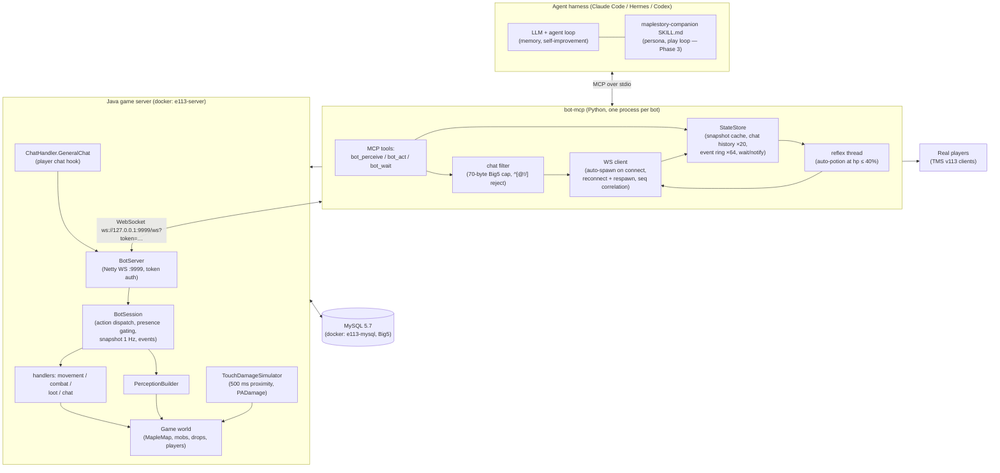
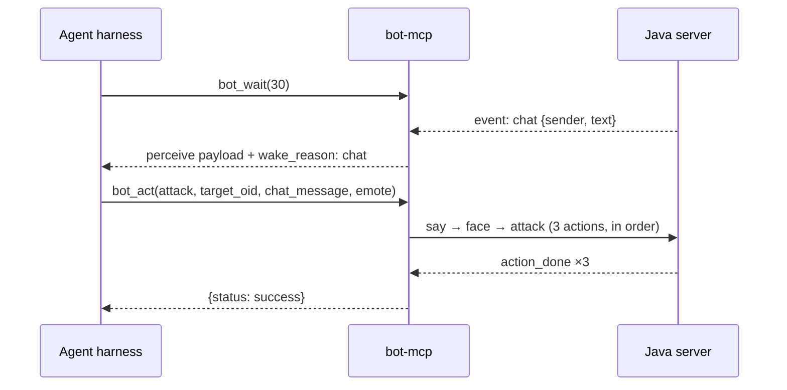
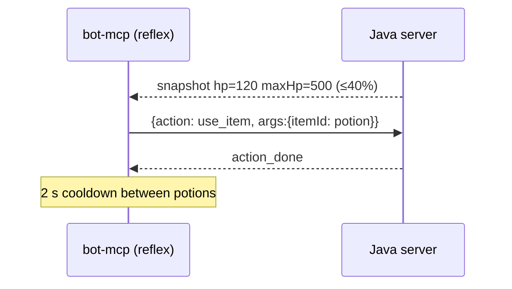

# Bot Ecosystem — Source of Truth

Living document. Any change to a component, connection, or message type in the
bot system MUST update this file in the same commit. Rendered by GitHub's
native Mermaid support.

Status: Phase 2 done (see issue #3). Spec: `docs/superpowers/specs/2026-07-11-bot-mcp-skill-design.md` (local).

## Component map



## Connections

| Link | Transport | Auth | Config |
|---|---|---|---|
| harness → bot-mcp | MCP over stdio (`python -m botmcp`) | none (local child process) | `BOTMCP_CONFIG` env → `config.yaml` |
| bot-mcp → server | WebSocket, JSON text frames | `?token=` query param = `tms.BotToken` | `config.yaml`: `ws_url`, `token` |
| players → server | v113 game protocol | game accounts | ports 8484, 8585–8604 |
| server → MySQL | JDBC (mysql-connector 5.1.12) | `Settings.ini` (`mysql:3306` inside docker) | `.env` |

## Message flows

### Startup / lifecycle (agent has NO spawn control)

```mermaid
sequenceDiagram
    participant H as Agent harness
    participant M as bot-mcp
    participant S as Java server

    H->>M: launch (MCP stdio init)
    M->>S: WS connect ?token=…
    S-->>M: 101 (or 401 bad token)
    M->>S: {action: spawn, seq 1, args:{mapId}}
    S-->>M: action_done — bot visible in game
    loop every 1 s
        S-->>M: snapshot (cached in StateStore)
    end
    Note over M,S: WS drop → server despawns bot;<br/>bot-mcp reconnects + respawns (3 s backoff)
```

### One agent turn (perceive → act → wait)



### Reflex (agent not involved)



## Wire protocol (bot-mcp ⇄ server)

Inbound to server: `{"action": name, "seq": ≥1, "args": {…}}` —
`spawn{mapId}`, `idle`, `move_to{x,y}`, `face{expressionId}`, `attack{mobId:oid}`,
`pickup{dropId:oid}`, `use_item{itemId}`, `say{text}`.

Outbound from server:
- `action_done{seq, action}` / `action_failed{seq, reason}`
- `snapshot{data}` at 1 Hz — `name, job, mesos, mapId, position{x,y}, hp, maxHp, mp, maxMp, level, inventorySummary, mobs, drops, players, portals`
- `event{event, data}` — `chat{senderId:int, senderName:str, text:str}`, `damaged{damage, mobId, hp, maxHp}`, `died{}`, `mob_killed{oid:int, mobId:int}`

## Security model (structural, not prompt-based)

- Agent has 3 tools only; spawn/despawn/logout/trade **do not exist** anywhere in the protocol
- Token-gated localhost WS; bot char is a normal DB character with no login credentials in play
- Server rejects bot `say` starting `@ ! /` (command injection); bot-mcp filters first
- Presence gating: server refuses actions when no real player is on the map