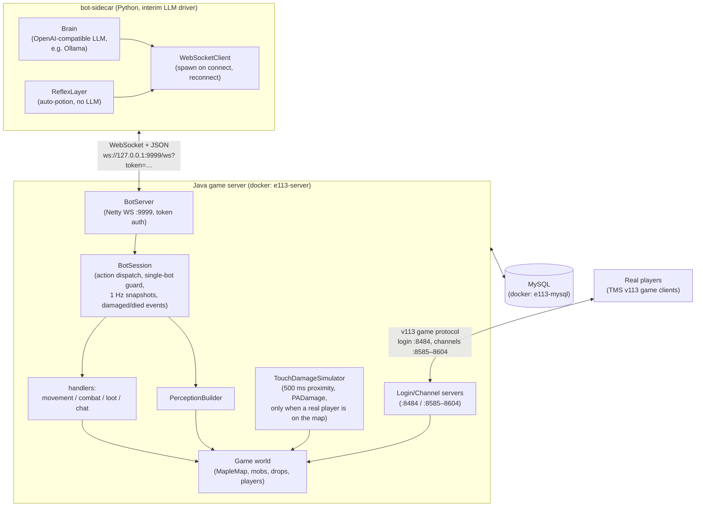
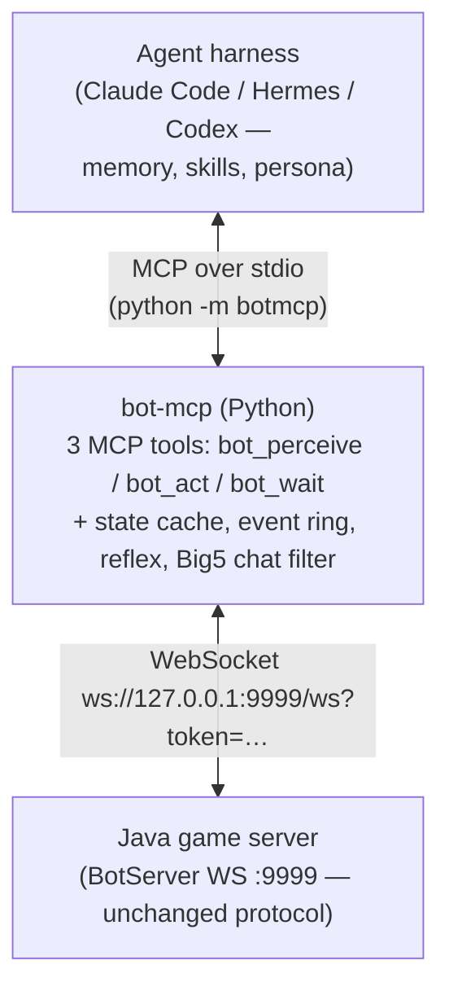

# Bot Ecosystem — Architecture

Living document. Any change to a component, connection, or message type in the
bot system MUST update this file in the same commit. Diagrams render natively
on GitHub (Mermaid).

Status: Phase 1 done, Phase 2 (bot-mcp) **not started** — tracking in
[issue #3](https://github.com/ckw1206/MapleStory-v113-Server-Eimulator/issues/3).

## Component map (as built today)

The bot character has **no game client**: it is loaded straight from the DB
(`tms.BotCharacterId` in `Settings.ini`) behind a mock network session, and is
driven entirely over the WebSocket. Real players connect with the normal TMS
v113 client and see the bot as just another character on the map.

## Connections

| Link | Transport | Auth | Config |
|---|---|---|---|
| bot-sidecar → server | WebSocket, JSON text frames | `?token=` = `tms.BotToken` | `bot-sidecar/config.yaml` |
| players → server | v113 game protocol | game accounts | ports 8484, 8585–8604 |
| server → MySQL | JDBC | `Settings.ini` (`mysql:3306` inside docker) | `.env` |
| bot-sidecar → LLM | OpenAI-compatible HTTP | `api_key` | `bot-sidecar/config.yaml` |

## Wire protocol (bot ⇄ BotServer)

Inbound to server, one JSON object per text frame:
`{"action": name, "seq": ≥1, "args": {…}}` —
`spawn{mapId}`, `idle`, `move_to{x,y}`, `face{expressionId}`, `attack{mobId:oid}`,
`pickup{dropId:oid}`, `use_item{itemId}`, `say{text}`.

Outbound from server:

- `action_done{seq, action}` / `action_failed{seq, reason}` (seq 0 = unparseable request)
- `snapshot{data}` at 1 Hz — `mapId, position{x,y}, hp, maxHp, mp, maxMp, level, inventorySummary, mobs, drops, players, portals`
- `event{event, data}` — `damaged{damage, mobId, hp, maxHp}`, `died{}`

## Planned: Phase 2+ — bot-mcp (issue #3, not built yet)

The sidecar's built-in brain will be replaced by an agent harness talking MCP
to a thin `bot-mcp` middleware; plan in
`docs/superpowers/plans/2026-07-11-bot-mcp-phase2.md`.

Java deltas still needed for Phase 2: player-chat event forwarding
(`chat` event), `mob_killed` event, presence gating on actions
(`no_player_on_map`), snapshot `name`/`job`/`mesos`, server-side `^[@!/]`
chat reject.
